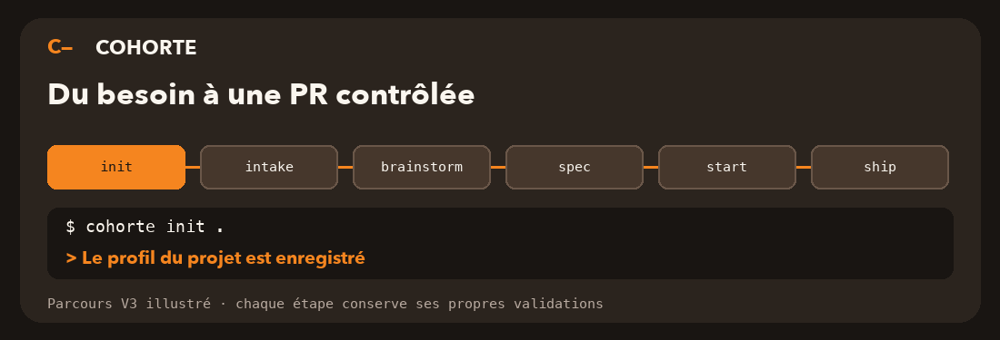

<div align="center">


# Cohorte

**Du besoin à une PR contrôlée, avec des agents de code supervisés.**

[](https://pypi.org/project/cohorte-engine/)
[](https://github.com/TheBidouilleAgency/cohorte/actions/workflows/ci.yml)
[](LICENSE)
[](https://thebidouilleagency.github.io/cohorte/)

[Documentation](https://thebidouilleagency.github.io/cohorte/) · [Premiers pas](https://thebidouilleagency.github.io/cohorte/guide/demarrage) · [Commandes](https://thebidouilleagency.github.io/cohorte/reference/cli)



<sub>Illustration du parcours V3 ; chaque étape garde ses propres validations. `intake` est facultatif si vous partez directement d'une idée.</sub>

</div>

Cohorte aide à **cadrer une demande, conserver les décisions et faire exécuter le travail dans un espace Git isolé**. Il peut utiliser Codex ou Claude comme agent de code ; le moteur garde le même suivi du workflow. Un brief ou une spec ne modifie pas le code. L'exécution commence seulement après la validation de la spec et un lancement explicite.

## Pourquoi l'utiliser ?

| Quand le travail déraille | Ce que Cohorte conserve ou vérifie |
| --- | --- |
| « On a oublié ce qu'on avait décidé. » | Les réponses, briefs, specs et décisions sont enregistrés avec leurs révisions. |
| « L'agent a commencé avant qu'on soit d'accord. » | La spec est relue puis gelée avec une approbation liée à son contenu exact. |
| « L'API et l'interface ne vont pas ensemble. » | Les surfaces et leurs dépendances sont décrites dans le profil ; une spec multi-surface référence un contrat partagé. |
| « La revue a dit oui trop vite. » | Des checks déterministes et une revue indépendante contrôlent le résultat. |
| « Une commande a touché mon dépôt. » | Le travail de code se fait dans un worktree Git distinct ; la livraison exige une décision séparée. |

## Démarrer

Le paquet Python s'appelle **`cohorte-engine`** ; la commande est **`cohorte`**. Il faut Python 3.12 ou plus récent. Pour installer cette préversion après sa publication :

```bash
uv tool install 'cohorte-engine==1.0.0a14'
cohorte --version
cohorte doctor
```

Dans le dépôt où vous voulez travailler :

```bash
cohorte init .
cohorte profile show
```

`init` découvre le projet et stocke son profil dans les données locales de Cohorte. Il ne dépose pas une série de fichiers dans votre dépôt. **Relisez le profil**, surtout les surfaces, les fichiers partagés et les commandes de test ; corrigez-le avec `cohorte profile edit` si nécessaire.

La suite dépend de votre point de départ :

| Vous avez… | Lancez… | Vous obtenez… |
| --- | --- | --- |
| Une idée à explorer | `cohorte brainstorm` | Un brief avec pistes, objections et questions, sans modification du code. |
| Un ticket, un message ou une URL | `cohorte intake` | Un triage : fonctionnalité, correctif ou questions à préciser. |
| Un brief prêt à transformer en travail | `cohorte spec IDENTIFIANT` | Un brouillon, puis une spec gelée après votre approbation. |
| Une spec gelée à exécuter | `cohorte start IDENTIFIANT` | Un run dans un worktree avec checks et revue. |

**`intake` signifie « recevoir et trier la demande ».** Cohorte peut demander des précisions avant de choisir la suite. Pour une fonctionnalité, reprenez les réponses avec `cohorte brainstorm --from-intake IDENTIFIANT`. Pour un bug, préparez un correctif avec `cohorte patch-spec --from-intake IDENTIFIANT`. Vous pouvez aussi sauter `intake` et lancer `brainstorm` directement si vous avez déjà une idée claire. [Voir le parcours détaillé](https://thebidouilleagency.github.io/cohorte/guide/parcours).

Ces parcours guidés sont disponibles depuis `1.0.0a5` ; `1.0.0a6` corrige aussi l’arrêt du service avec un client connecté. Depuis `1.0.0a7`, le panel `brainstorm` reçoit des extraits pertinents du dépôt avec leurs chemins et lignes à chaque tour. `1.0.0a8` étend ces pistes au cadrage et aux agents de construction, revue et correction ; `1.0.0a9` les étend à l’intégration Fleet. `1.0.0a10` ajoute les propositions de l'agent au parcours `spec` et `1.0.0a11` les affiche même si l'agent reformule les questions. Vérifiez la commande globale avec `cohorte --version`. Depuis le dépôt, `uv run cohorte` exécute la version de développement.

## Les étapes du parcours

```text
Projet → [intake si demande à trier] → brainstorm → spec approuvée → start → revue → ship approuvé
```

`brainstorm` réunit des perspectives produit, architecture et QA. Il propose un cadrage, ne prend pas de décision à votre place, et peut relancer un tour après vos réponses. `cohorte brief show IDENTIFIANT` relit le résultat sans relancer le panel. `spec` demande à l'agent une proposition de scénarios, critères, checks et cas d'erreur, puis vous laisse accepter ou corriger le brouillon. Les questions sans réponse restent ouvertes ; `cohorte spec --manual` garde la saisie champ par champ.

`start` lance les agents sur une spec gelée dans un worktree isolé, puis vérifie le résultat. `ship` reste une étape séparée : après accord, Cohorte peut créer un commit, pousser et ouvrir une PR ou MR. Il ne merge ni ne déploie. [Détails et exemples](https://thebidouilleagency.github.io/cohorte/guide/parcours).

## Comptes et données

Cohorte utilise les clients officiels Codex et, avec l'extra `claude`, Claude. Les comptes sont vérifiés avec `cohorte auth status` et `cohorte auth verify PROVIDER --live`. Les jetons des fournisseurs ne sont pas stockés dans les profils Cohorte. L'état, les artefacts et les décisions sont conservés localement ; l'option `--data-dir` permet d'isoler un essai.

Les profils peuvent activer des intégrations de recherche de contexte, de design, de Kanban ou de notes de release. Elles restent optionnelles et leur disponibilité est signalée explicitement. [Configurer les intégrations](https://thebidouilleagency.github.io/cohorte/reference/integrations).

## Pour contribuer

```bash
uv sync --all-extras
uv run pytest
uv run ruff check .
uv run mypy src/cohorte
npm ci --prefix docs && npm run build --prefix docs
```

`npm` ne sert ici qu'au site de documentation VitePress : l'ancien paquet npm `cohorte` correspond à V2. Pour publier le moteur Python, consultez le [guide de release](docs/RELEASING.md). L'[état de l'implémentation](docs/IMPLEMENTATION.md), la [matrice de qualification](docs/qualification/README.md) et la [référence du protocole](docs/PROTOCOL.md) distinguent les parcours opérationnels des preuves encore partielles.
